```{r setup, include=FALSE}
knitr::opts_chunk$set(warning=FALSE, message=FALSE, fig.align="center", fig.width = 15, echo=FALSE) 
library(tidyverse)
library(corrr)
library(gridExtra)
library(reshape2)
library(tableone)
library(Hmisc)
library(ggcorrplot)

setwd(getwd())

df <- read.csv("data/dataset_2020-10-10.csv")
vol <- read.csv("data/stats_vol_full.csv")

vol$record_id <- substr(vol$Subject, 5, 10)

d <- merge(df, vol, by = 'record_id')

d$Group <- factor(d$Group, levels = c("Young Adults", "Older Adults"))
d$sleepundersix <- factor(ifelse(d$sleep_time_mean_sleep < 360, "Under 6 h", "At least 6 h"))
```


```{r cvlt, include=FALSE}

d %>%
  select(matches("cvlt"))

```

## Introduction: Hippocampal differentiation

- The hippocampus shows a long axis anterior-posterior differentiation of function
- Poppenk et al. (2013) suggested that the type of processing in the hippocampus varied from fine to coarse grained in a posterior to anterior direction, based on evidence that receptive fields vary from narrow at the posterior end of the hippocampus to broad at the anterior end (Kjelstrup et al., 2008; Maurer Vanrhoads, Sutherland, Lipa, & McNaughton, 2005). 
- Anterior = pattern completion, posterior = pattern separation 

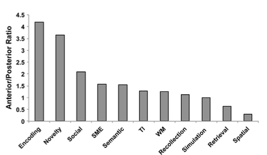

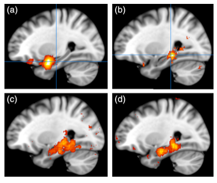
- The anterior and posterior portions may undergo different developmental trajectories across the lifespan, and may give rise to some of the cognitive changes that commonly accompany the aging process (i.e., episodic memory)


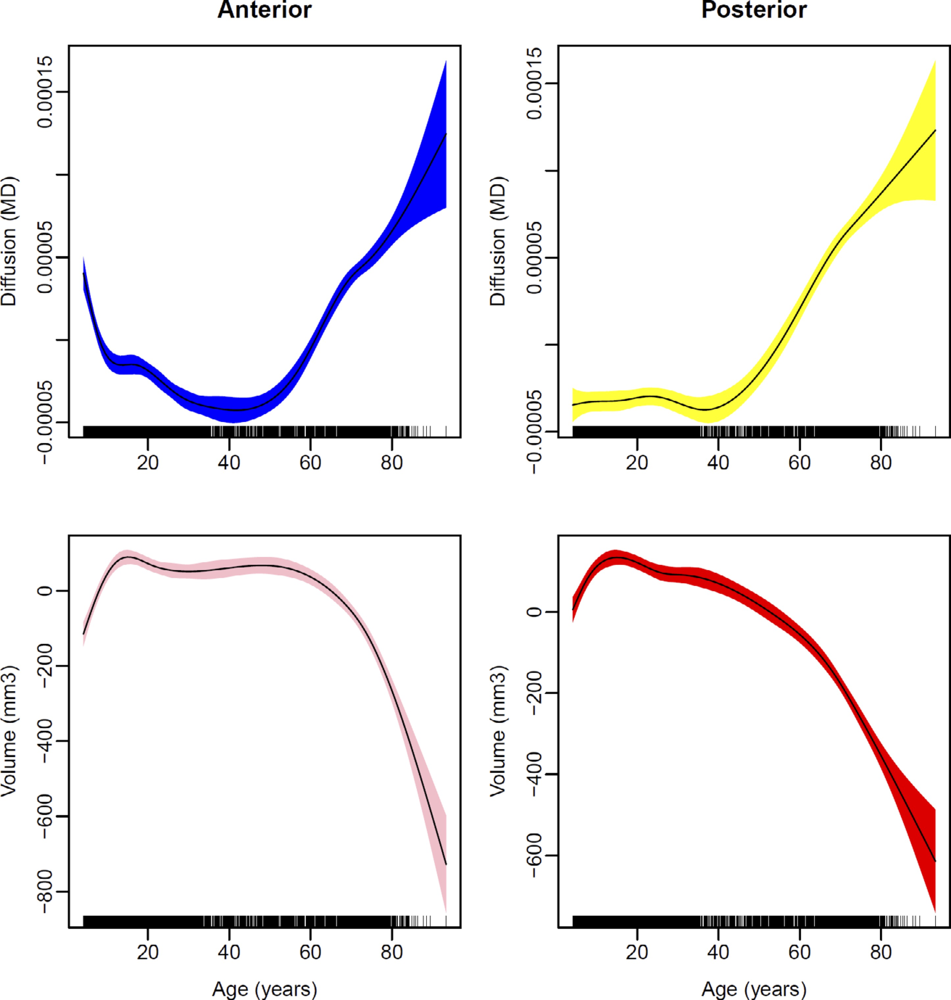

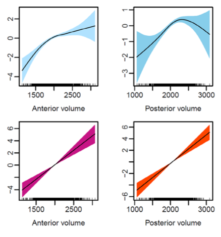
## Sleep and the hippocampus

- Hippocampus involved in sleep architecture (theta in REM, sharp wave ripples in NREM, coupling with slow wave)
- Chronic sleep disruption and circadian rhythmicity affect hippocampal neurogenesis in animals (Raven et al., 2018; Kreutzmann et al., 2015)
- In older adults, more robust rest-activity rhythms were associated with greater anterior hippocampal volume (Sherman et al., 2015)
- Sleep disturbance in older adults predicts increasingly worse scores on standardized neuropsychological tests, including memory subcomponents that depend upon the hippocampus (HVLT)

## Research Question 

Are sleep-wake patterns associated with volumetric differences along the hippocampal long axis that underlie episodic memory? 

## Methods
- Healthy younger (n = `r format(count(d[d$Group == "Young Adults",]), digits = 3)`, age = `r format(mean(d$age[d$Group == "Young Adults"]), digits = 3)`, ±`r format(sd(d$age[d$Group == "Young Adults"]), digits = 3)`) and older (n = `r format(count(d[d$Group == "Young Adults",]), digits = 3)`, age = `r format(mean(d$age[d$Group == "Older Adults"]), digits = 3)`, ±`r format(sd(d$age[d$Group == "Older Adults"]), digits = 3)`) adults
- Actigraphy
- fMRI scanning
- Episodic memory measures: associative memory task, CVLT (older adults only)
- Working memory/novelty measure: repeat task

## Actigraphy
- Selected mean sleep duration, acrophase, amplitude, and interdaily stability as measures of interest


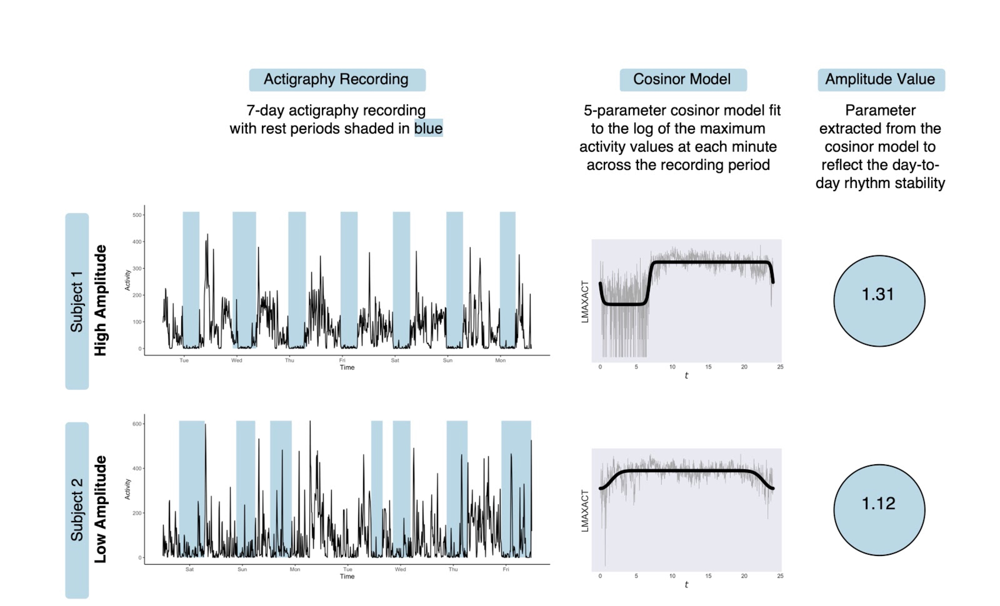
- Planned to use CVLT, but did not have data available from younger adults :(


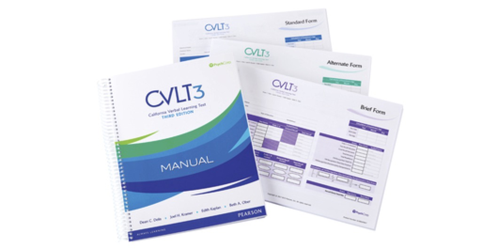


### Associative memory task
- Had associative memory task data, but really only have a good measure of intial encoding and short-term recall (no long-term recall measure)
- This is problematic because really wanted long-term recall measure ([Langnes et al. 2020](10.1002/hipo.23189))


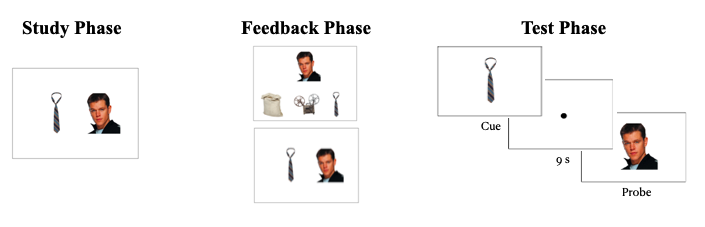


## Repeat task
- 1-back working memory task
- Novelty vs. familiarity
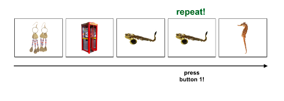

## Participants

```{r demo, include = FALSE, warnings = FALSE}
myVars <- c('Group', 'age', 'sex', 'years_educ', 'global_psqi', 'cesd_score', 'gds_total', 'sleep_time_mean_sleep', 'efficiency_mean_sleep', 'total_ac_mean_active', 'actamp', 'IS', 'actphi')

catVars <- c('Group', 'sex')

tab1 <- CreateTableOne(vars = myVars, strata = 'Group' , data = d, factorVars = catVars)

```

```{r}
kableone(print(tab1, cramVars=TRUE, test = FALSE))

```


## Parcellation
- Used brainlife.io to obtain hippocampal volume measures
- Uploaded [BIDS dataset](https://brainlife.io/project/6051536f38fe127a89efe276/dataset/)


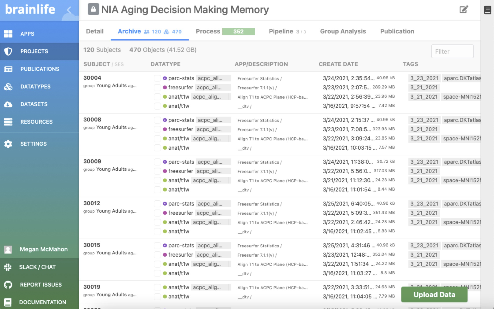
- Checked orientation of all T1 images
- Ran ACPC alignment

### Originial T1:
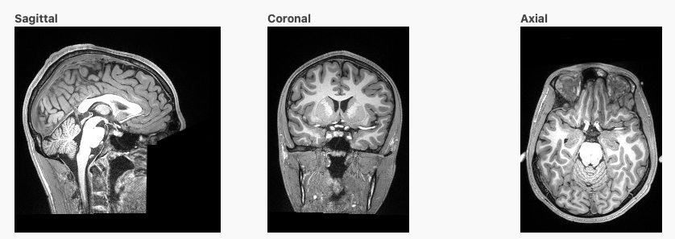


### ACPC aligned:
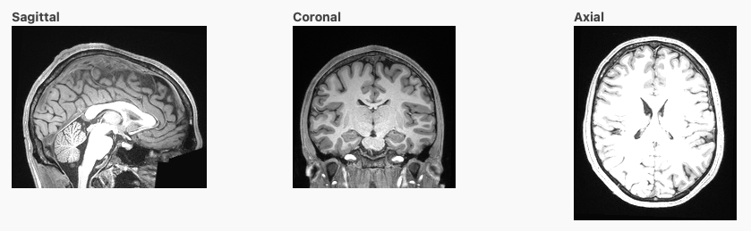

- Used "HBT" divisions ([Iglesias et al., 2015](https://doi.org/10.1016/j.neuroimage.2015.04.042))
- This parcellation was based on both ex vivo and in vivo data


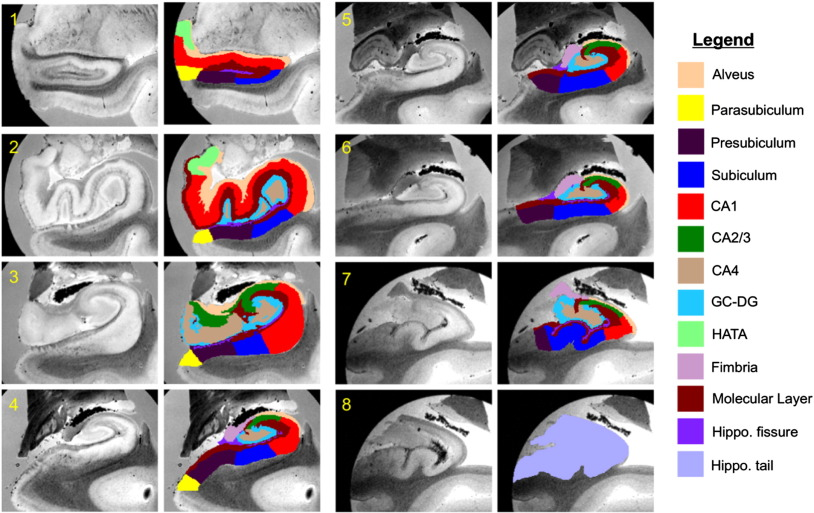


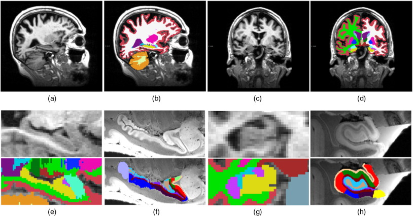


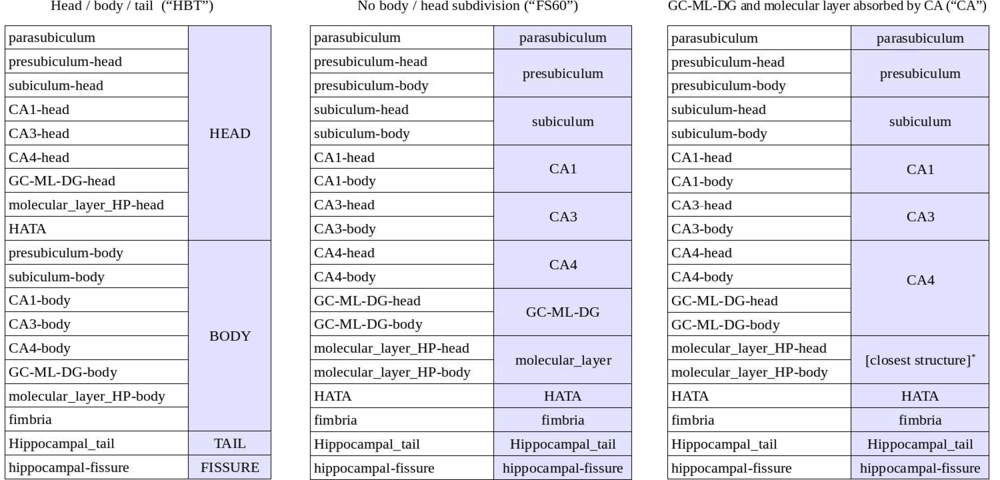

## Results
## Aging and hippocampal volume

```{r}

d$Hippocampus <- d$Left.Hippocampus + d$Right.Hippocampus
d$Hippocampal_tail <- d$Left.Hippocampal_tail + d$Right.Hippocampal_tail
d$Hippocampal_head <- d$Left.Whole_hippocampal_head + d$Right.Whole_hippocampal_head

d %>%
  rename(`Head` = Hippocampal_head) %>%
  rename(`Tail` = Hippocampal_tail) %>%
  rename(`Total` = Hippocampus) %>%
  melt(id.vars = c('record_id', 'Group', 'age'), measure.vars = c('Total', 'Head', 'Tail'), variable.name = 'Hippocampal region', value.name = 'Hippocampal volume') %>%
  ggplot(aes(x = age, y = `Hippocampal volume`, group = Group, color = Group)) +
  geom_point() + 
  stat_smooth(method = "loess", formula = 'y ~ x') +
  scale_color_brewer(palette = 'Set1') + theme_minimal() + 
  facet_wrap(. ~ `Hippocampal region`, scales = 'free', nrow=3) + 
  theme_minimal() +
  theme(legend.position="none", text=element_text(size=14)) + xlab("Age")
  

ggsave("figures/hcvol_age.png", dpi=300)
```

```{r icv_norm, include = FALSE}
d0 <- d
ICVnorm <- function(d, x){
  
  f <- paste(x, "~ EstimatedTotalIntraCranialVol")
  b <- as.numeric((lm(f, d))$coefficients[2])
  d[x] = d[x] - b * (d$EstimatedTotalIntraCranialVol - mean(d$EstimatedTotalIntraCranialVol, na.rm = TRUE))
  
  return(d)
}

cols <- names(d[,grepl("hippoc|Hippoc|CA|Left", names(d))])

for (col in cols){
  d <- ICVnorm(d, col)
}

```

### ICV normalized 

We wanted to look at hippocampal volume independently of total intracranial volume, so we calculated HC volume as follows: adjusted HC volume = raw HC volume – b X (ICV – average ICV), where b is the slope of regression of the raw HC volume on ICV ([Brehmer et al., 2020](https://doi.org/10.1016/j.neuroimage.2019.116475)).

```{r icv_norm_plots}

d$Hippocampus <- d$Left.Hippocampus + d$Right.Hippocampus
d$Hippocampal_tail <- d$Left.Hippocampal_tail + d$Right.Hippocampal_tail
d$Hippocampal_head <- d$Right.Whole_hippocampal_head + d$Left.Whole_hippocampal_head

d %>%
  rename(`Head` = Hippocampal_head) %>%
  rename(`Tail` = Hippocampal_tail) %>%
  rename(`Total` = Hippocampus) %>%
  melt(id.vars = c('record_id', 'Group', 'age'), measure.vars = c('Total', 'Head', 'Tail'), variable.name = 'Hippocampal region', value.name = 'Hippocampal volume') %>%
  ggplot(aes(x = age, y = `Hippocampal volume`, group = Group, color = Group)) +
  geom_point() + 
  stat_smooth(method = "loess", formula = 'y ~ x') +
  scale_color_brewer(palette = 'Set1') + theme_minimal() + 
  facet_wrap(. ~ `Hippocampal region`, scales = 'free', nrow=3) + 
  theme_minimal() +
  theme(legend.position="none", text=element_text(size=14)) + xlab("Age")


ggsave("figures/hcvol_age_ICVnorm.png", dpi=300)

```

```{r read_mem_data, include = FALSE}
mem <- read.csv('data/mem_results_06-2021.csv')

head(mem)
```

```{r include = FALSE}
dmem <- merge(d, mem, by = 'record_id')

dmem %>%
  select(-contains("Right")) %>%
  select(is.numeric) %>%
  correlate(use="pairwise.complete.obs", method="spearman") %>%
  rplot(print_cor = TRUE) + theme(axis.text.x = element_text(angle = 90))
  
#all
dmem %>%
  select(matches("hippocampal_tail|hippocampal_head"), acc_mean.learning, acc_mean.test) %>%
  correlate(use="pairwise.complete.obs", method="spearman") %>%
  rplot(print_cor = TRUE) + theme(axis.text.x = element_text(angle = 90))

#oa
dmem %>%
  filter(Group == "Older Adults") %>%
  select(matches("hippocampal_tail|hippocampal_head"), acc_mean.learning, acc_mean.test) %>%
  correlate(use="pairwise.complete.obs", method="spearman") %>%
  rplot(print_cor = TRUE) + theme(axis.text.x = element_text(angle = 90))

#ya
dmem %>%
  filter(Group == "Young Adults") %>%
  select(matches("hippocampal_tail|hippocampal_head"), acc_mean.learning, acc_mean.test) %>%
  correlate(use="pairwise.complete.obs", method="spearman") %>%
  rplot(print_cor = TRUE) + theme(axis.text.x = element_text(angle = 90))
```

## Memory Performance

```{r include = FALSE}
myVars2 <- c('Group', 'cvlt_sdelay_recall_zscore', 'cvlt_ldelay_recall_zscore', 'cvlt_recognition_hits_zscore','cvlt_recognition_fp_zscore', 'cvlt_zscore', 'acc_mean.learning', 'acc_std.learning', 'rt_c_mean.learning', 'rt_c_std.learning', 'acc_mean.test', 'acc_std.test', 'rt_c_mean.test', 'rt_c_std.test')

tab2 <- CreateTableOne(vars = myVars2, strata = 'Group' , data = dmem, factorVars = catVars)
```

```{r}
kableone(print(tab2, cramVars=TRUE, test = FALSE))
```

```{r}
dmem %>%
  select(record_id, acc_mean.learning, acc_mean.test) %>%
  filter((acc_mean.learning < 0.33)|(acc_mean.test < 0.55))

dmem <- dmem %>%
  filter(acc_mean.learning > 0.33)
  
```

## Hippocampal volume and CVLT performance within older adults
- Only had CVLT data for older adults
- Did not see relationship between hippocampal volume and CVLT memory
```{r check-assumptions}
#model <- lm(cvlt_1 ~ Hippocampal_head, data=dmem)
#par(mfrow = c(2, 2))
#plot(model)
#hist(model$residuals)
```

```{r}
dmem %>%
  filter(acc_mean.test > 0.50) %>%
  filter(acc_mean.learning > 0.33) %>%
  filter(Group == "Older Adults") %>%
  select(cvlt_1, cvlt_listb, cvlt_sdelay_recall, cvlt_ldelay_recall, cvlt_recognition_hits) %>%
  pivot_longer(cols = c('cvlt_1', 'cvlt_sdelay_recall', 'cvlt_listb', 'cvlt_ldelay_recall', 'cvlt_recognition_hits'), names_to = 'CVLT Measure', values_to = 'Raw Score') %>%
  ggplot(aes(x=`Raw Score`)) + geom_density(size=2) + facet_wrap(~ `CVLT Measure` ) + theme_classic()
```

```{r}
dmem$tx_cvlt_ldelay_recall <- log10(dmem$cvlt_ldelay_recall)
dmem$tx_cvlt_sdelay_recall <- log10(dmem$cvlt_sdelay_recall)

dmem %>%
  filter(acc_mean.test > 0.50) %>%
  filter(acc_mean.learning > 0.33) %>%
  filter(Group == "Older Adults") %>%
  select(tx_cvlt_sdelay_recall, tx_cvlt_ldelay_recall) %>%
  pivot_longer(cols = c('tx_cvlt_sdelay_recall', 'tx_cvlt_ldelay_recall'), names_to = 'CVLT Measure', values_to = 'Raw Score') %>%
  ggplot(aes(x=`Raw Score`)) + geom_density(size=2) + facet_wrap(~ `CVLT Measure` ) + theme_classic()
```


```{r}

dmem %>%
  filter(acc_mean.test > 0.50) %>%
  filter(acc_mean.learning > 0.33) %>%
  rename(`Head` = Hippocampal_head) %>%
  rename(`Tail` = Hippocampal_tail) %>%
  pivot_longer(cols=c("Head", "Tail"), names_to = 'Hippocampal region', values_to = 'Hippocampal subregion volume') %>%
  pivot_longer(cols=contains("tx_cvlt"), names_to = 'CVLT Measure', values_to = 'Raw Score') %>%
  ggplot(aes(x = `Hippocampal subregion volume`, y = `Raw Score`, group = Group, color = Group)) +
  geom_point() + 
  stat_smooth(method = "lm", formula = 'y ~ x') +
  scale_color_brewer(palette = 'Set1') + theme_minimal() + theme(legend.position = "none") +
  facet_grid(`Hippocampal region` ~ `CVLT Measure`, scales = 'free', space = "free") + 
  ylab("Raw Score") + ggtitle("Hippocampal subregion volume and CVLT performance")

```

## Sleep and CVLT performance

```{r}
dmem %>%
  melt(id.vars = c('record_id', 'Group', 'cvlt_1', 'cvlt_sdelay_recall', 'cvlt_ldelay_recall', 'cvlt_recognition_hits', 'sleep_time_mean_sleep', 'actamp'), measure.vars = c('cvlt_1', 'cvlt_sdelay_recall', 'cvlt_ldelay_recall', 'cvlt_recognition_hits', 'tx_cvlt_sdelay_recall', 'tx_cvlt_ldelay_recall'), variable.name = 'CVLT Measure', value.name = 'Raw Score') %>%
  ggplot(aes(x = actamp, y = `Raw Score`, group = Group, color = Group)) +
  geom_point() + 
  stat_smooth(method = "lm", formula = 'y ~ x') +
  facet_grid(. ~ `CVLT Measure`, scales = 'free') + 
  scale_color_brewer(palette = 'Set1') + theme_minimal() + 
  xlab("Amplitude")

dmem %>%
  melt(id.vars = c('record_id', 'Group', 'cvlt_1', 'cvlt_sdelay_recall', 'cvlt_ldelay_recall', 'cvlt_recognition_hits', 'sleep_time_mean_sleep', 'IS'), measure.vars = c('cvlt_1', 'cvlt_sdelay_recall', 'cvlt_ldelay_recall', 'cvlt_recognition_hits', 'tx_cvlt_sdelay_recall', 'tx_cvlt_ldelay_recall'), variable.name = 'CVLT Measure', value.name = 'Raw Score') %>%
  ggplot(aes(x = IS, y = `Raw Score`, group = Group, color = Group)) +
  geom_point() + 
  stat_smooth(method = "lm", formula = 'y ~ x') +
  facet_grid(. ~ `CVLT Measure`, scales = 'free') + 
  scale_color_brewer(palette = 'Set1') + theme_minimal() + 
  xlab("IS")

dmem %>%
  melt(id.vars = c('record_id', 'Group', 'cvlt_1', 'cvlt_sdelay_recall', 'cvlt_ldelay_recall', 'cvlt_recognition_hits', 'sleep_time_mean_sleep', 'actphi'), measure.vars = c('cvlt_1', 'cvlt_sdelay_recall', 'cvlt_ldelay_recall', 'cvlt_recognition_hits', 'tx_cvlt_sdelay_recall', 'tx_cvlt_ldelay_recall'), variable.name = 'CVLT Measure', value.name = 'Raw Score') %>%
  ggplot(aes(x = actphi, y = `Raw Score`, group = Group, color = Group)) +
  geom_point() + 
  stat_smooth(method = "lm", formula = 'y ~ x') +
  facet_grid(. ~ `CVLT Measure`, scales = 'free') + 
  scale_color_brewer(palette = 'Set1') + theme_minimal() + 
  xlab("Acrophase")

dmem %>%
  melt(id.vars = c('record_id', 'Group', 'cvlt_1', 'cvlt_sdelay_recall', 'cvlt_ldelay_recall', 'cvlt_recognition_hits', 'sleep_time_mean_sleep', 'total_ac_mean_active'), measure.vars = c('cvlt_1', 'cvlt_sdelay_recall', 'cvlt_ldelay_recall', 'cvlt_recognition_hits', 'tx_cvlt_sdelay_recall', 'tx_cvlt_ldelay_recall'), variable.name = 'CVLT Measure', value.name = 'Raw Score') %>%
  ggplot(aes(x = total_ac_mean_active, y = `Raw Score`, group = Group, color = Group)) +
  geom_point() + 
  stat_smooth(method = "lm", formula = 'y ~ x') +
  facet_grid(. ~ `CVLT Measure`, scales = 'free') + 
  scale_color_brewer(palette = 'Set1') + theme_minimal() + 
  xlab("Mean Daily Activity")

dmem %>%
  melt(id.vars = c('record_id', 'Group', 'cvlt_1', 'cvlt_sdelay_recall', 'cvlt_ldelay_recall', 'cvlt_recognition_hits', 'sleep_time_mean_sleep', 'actamp'), measure.vars = c('cvlt_1', 'cvlt_sdelay_recall', 'cvlt_ldelay_recall', 'cvlt_recognition_hits', 'sleep_time_mean_sleep', 'tx_cvlt_ldelay_recall'), variable.name = 'CVLT Measure', value.name = 'Raw Score') %>%
  ggplot(aes(x = sleep_time_mean_sleep, y = `Raw Score`, group = Group, color = Group)) +
  geom_point() + 
  stat_smooth(method = "lm", formula = 'y ~ x') +
  facet_grid(. ~ `CVLT Measure`, scales = 'free') + 
  scale_color_brewer(palette = 'Set1') + theme_minimal() + 
  xlab("TST")

```

## Hippocampal volume and associative memory task performance

- Using the associative memory task allowed us to include the young adult comparison group.
- There was a significant Group by hippocampal head volume effect on associative memory accuracy during the test phase, where older adults showed a positive association between hippocampal head volume and memory accuracy, whereas young adults showed the opposite trend.

```{r }

dmem %>%
  filter(acc_mean.test > 0.50) %>%
  filter(acc_mean.learning > 0.33) %>%
  rename(`Head` = Hippocampal_head) %>%
  rename(`Tail` = Hippocampal_tail) %>%
  melt(id.vars = c('record_id', 'Group', 'Head', 'Tail'), measure.vars = c('acc_mean.learning', 'acc_mean.test'), variable.name = 'TaskPhase', value.name = 'Accuracy') %>%
  melt(id.vars = c('record_id', 'Group', 'TaskPhase', 'Accuracy'), measure.vars = c('Head', 'Tail'), variable.name = 'HippocampalRegion', value.name = 'Volume') %>%
  mutate(TaskPhase =  factor(TaskPhase, labels = c("Learning", "Test"))) %>%
  ggplot(aes(x = Volume, y = Accuracy, group = Group, color = Group)) +
  geom_point() + 
  stat_smooth(method = "lm", formula = 'y ~ x') +
  facet_wrap(HippocampalRegion ~ TaskPhase, scales = 'free') + 
  scale_color_brewer(palette = 'Set1') + theme_minimal() 
  
dmem %>%
  filter(acc_mean.test > 0.50) %>%
  filter(acc_mean.learning > 0.33) %>%
  rename(`Head` = Hippocampal_head) %>%
  rename(`Tail` = Hippocampal_tail) %>%
  melt(id.vars = c('record_id', 'Group', 'Head', 'Tail'), measure.vars = c('acc_std.learning', 'acc_std.test'), variable.name = 'TaskPhase', value.name = 'AccuracyStd') %>%
  melt(id.vars = c('record_id', 'Group', 'TaskPhase', 'AccuracyStd'), measure.vars = c('Head', 'Tail'), variable.name = 'HippocampalRegion', value.name = 'Volume') %>%
  mutate(TaskPhase =  factor(TaskPhase, labels = c("Learning", "Test"))) %>%
  ggplot(aes(x = Volume, y = AccuracyStd, group = Group, color = Group)) +
  geom_point() + 
  stat_smooth(method = "lm", formula = 'y ~ x') +
  facet_wrap(HippocampalRegion ~ TaskPhase, scales = 'free') + 
  scale_color_brewer(palette = 'Set1') + theme_minimal() 

dmem %>%
  filter(acc_mean.test > 0.50) %>%
  filter(acc_mean.learning > 0.33) %>%
  rename(`Head` = Hippocampal_head) %>%
  rename(`Tail` = Hippocampal_tail) %>%
  melt(id.vars = c('record_id', 'Group', 'Head', 'Tail'), measure.vars = c('rt_c_mean.learning', 'rt_c_mean.test'), variable.name = 'TaskPhase', value.name = 'ResponseTime') %>%
  melt(id.vars = c('record_id', 'Group', 'TaskPhase', 'ResponseTime'), measure.vars = c('Head', 'Tail'), variable.name = 'HippocampalRegion', value.name = 'Volume') %>%
  mutate(TaskPhase =  factor(TaskPhase, labels = c("Learning", "Test"))) %>%
  ggplot(aes(x = Volume, y = ResponseTime, group = Group, color = Group)) +
  geom_point() + 
  stat_smooth(method = "lm", formula = 'y ~ x') +
  facet_wrap(HippocampalRegion ~ TaskPhase, scales = 'free') + 
  scale_color_brewer(palette = 'Set1') + theme_minimal() 

dmem %>%
  filter(acc_mean.test > 0.50) %>%
  filter(acc_mean.learning > 0.33) %>%
  rename(`Head` = Hippocampal_head) %>%
  rename(`Tail` = Hippocampal_tail) %>%
  melt(id.vars = c('record_id', 'Group', 'Head', 'Tail'), measure.vars = c('rt_c_std.learning', 'rt_c_std.test'), variable.name = 'TaskPhase', value.name = 'ResponseTimeStd') %>%
  melt(id.vars = c('record_id', 'Group', 'TaskPhase', 'ResponseTimeStd'), measure.vars = c('Head', 'Tail'), variable.name = 'HippocampalRegion', value.name = 'Volume') %>%
  mutate(TaskPhase =  factor(TaskPhase, labels = c("Learning", "Test"))) %>%
  ggplot(aes(x = Volume, y = ResponseTimeStd, group = Group, color = Group)) +
  geom_point() + 
  stat_smooth(method = "lm", formula = 'y ~ x') +
  facet_wrap(HippocampalRegion ~ TaskPhase, scales = 'free') + 
  scale_color_brewer(palette = 'Set1') + theme_minimal() 

```

## Sleep and memory performance
- In this study, young and older adult age groups showed differential relationships between acrophase and (1) accuracy during the test phase, and (2) response time on correct trials during both the learning and test phases

```{r }
dmem %>%
  filter(acc_mean.test > 0.50) %>%
  filter(acc_mean.learning > 0.33) %>%
  melt(id.vars = c('record_id', 'Group', 'actphi'), measure.vars = c('acc_mean.learning', 'acc_mean.test'), variable.name = 'TaskPhase', value.name = 'Accuracy') %>%
  mutate(TaskPhase =  factor(TaskPhase, labels = c("Learning", "Test"))) %>%
  ggplot(aes(x = actphi, y = Accuracy, group = Group, color = Group)) +
  geom_point() + 
  stat_smooth() +
  scale_color_brewer(palette = 'Set1') + theme_minimal() 
  
dmem %>%
  filter(acc_mean.test > 0.50) %>%
  filter(acc_mean.learning > 0.33) %>%
  melt(id.vars = c('record_id', 'Group', 'actphi'), measure.vars = c('acc_std.learning', 'acc_std.test'), variable.name = 'TaskPhase', value.name = 'AccuracyStd') %>%
  mutate(TaskPhase =  factor(TaskPhase, labels = c("Learning", "Test"))) %>%
  ggplot(aes(x = actphi, y = AccuracyStd, group = Group, color = Group)) +
  geom_point() + 
  stat_smooth() +
  scale_color_brewer(palette = 'Set1') + theme_minimal() 
  
dmem %>%
  filter(acc_mean.test > 0.50) %>%
  filter(acc_mean.learning > 0.33) %>%
  melt(id.vars = c('record_id', 'Group', 'actphi'), measure.vars = c('rt_c_mean.learning', 'rt_c_mean.test'), variable.name = 'TaskPhase', value.name = 'ResponseTime') %>%
  mutate(TaskPhase =  factor(TaskPhase, labels = c("Learning", "Test"))) %>%
  ggplot(aes(x = actphi, y = ResponseTime, group = Group, color = Group)) +
  geom_point() + 
  stat_smooth() +
  scale_color_brewer(palette = 'Set1') + theme_minimal() 
  
dmem %>%
  filter(acc_mean.test > 0.50) %>%
  filter(acc_mean.learning > 0.33) %>%
  melt(id.vars = c('record_id', 'Group', 'actphi'), measure.vars = c('rt_c_std.learning', 'rt_c_std.test'), variable.name = 'TaskPhase', value.name = 'ResponseTimeStd') %>%
  mutate(TaskPhase =  factor(TaskPhase, labels = c("Learning", "Test"))) %>%
  ggplot(aes(x = actphi, y = ResponseTimeStd, group = Group, color = Group)) +
  geom_point() + 
  stat_smooth() +
  scale_color_brewer(palette = 'Set1') + theme_minimal() 

```

```{r}
dmem %>%
  filter(acc_mean.test > 0.50) %>%
  filter(acc_mean.learning > 0.33) %>%
  melt(id.vars = c('record_id', 'Group', 'actamp'), measure.vars = c('acc_mean.learning', 'acc_mean.test'), variable.name = 'TaskPhase', value.name = 'Accuracy') %>%
  mutate(TaskPhase =  factor(TaskPhase, labels = c("Learning", "Test"))) %>%
  ggplot(aes(x = actamp, y = Accuracy, group = Group, color = Group)) +
  geom_point() + 
  stat_smooth() +
  scale_color_brewer(palette = 'Set1') + theme_minimal() 
  
dmem %>%
  filter(acc_mean.test > 0.50) %>%
  filter(acc_mean.learning > 0.33) %>%
  melt(id.vars = c('record_id', 'Group', 'actamp'), measure.vars = c('acc_std.learning', 'acc_std.test'), variable.name = 'TaskPhase', value.name = 'AccuracyStd') %>%
  mutate(TaskPhase =  factor(TaskPhase, labels = c("Learning", "Test"))) %>%
  ggplot(aes(x = actamp, y = AccuracyStd, group = Group, color = Group)) +
  geom_point() + 
  stat_smooth() +
  scale_color_brewer(palette = 'Set1') + theme_minimal() 
  
dmem %>%
  filter(acc_mean.test > 0.50) %>%
  filter(acc_mean.learning > 0.33) %>%
  melt(id.vars = c('record_id', 'Group', 'actamp'), measure.vars = c('rt_c_mean.learning', 'rt_c_mean.test'), variable.name = 'TaskPhase', value.name = 'ResponseTime') %>%
  mutate(TaskPhase =  factor(TaskPhase, labels = c("Learning", "Test"))) %>%
  ggplot(aes(x = actamp, y = ResponseTime, group = Group, color = Group)) +
  geom_point() + 
  stat_smooth() +
  scale_color_brewer(palette = 'Set1') + theme_minimal() 
  
dmem %>%
  filter(acc_mean.test > 0.50) %>%
  filter(acc_mean.learning > 0.33) %>%
  melt(id.vars = c('record_id', 'Group', 'actamp'), measure.vars = c('rt_c_std.learning', 'rt_c_std.test'), variable.name = 'TaskPhase', value.name = 'ResponseTimeStd') %>%
  mutate(TaskPhase =  factor(TaskPhase, labels = c("Learning", "Test"))) %>%
  ggplot(aes(x = actamp, y = ResponseTimeStd, group = Group, color = Group)) +
  geom_point() + 
  stat_smooth() +
  scale_color_brewer(palette = 'Set1') + theme_minimal() 
```

## Hippocampal volume and sleep 

- Nada!

```{r }

dmem %>%
  filter(sleep_time_mean_sleep < 700) %>%
  rename(`Head` = Hippocampal_head) %>%
  rename(`Tail` = Hippocampal_tail) %>%
  rename(SleepDuration = sleep_time_mean_sleep) %>%
  rename('Acrophase' = actphi) %>%
  melt(id.vars = c('record_id', 'Group', 'IS', 'SleepDuration', 'Acrophase'), measure.vars = c('Head', 'Tail'), variable.name = 'HippocampalRegion', value.name = 'Volume') %>%
  ggplot(aes(x = SleepDuration, y = Volume, group = Group, color = Group)) +
  geom_point() + 
  stat_smooth(method='lm') +
  scale_color_brewer(palette = 'Set1') + theme_minimal() + 
  facet_grid(. ~ HippocampalRegion, scales = 'free') + 
  theme(legend.position="none") +
  theme_minimal()

dmem %>%
  filter(sleep_time_mean_sleep < 700) %>%
  rename(`Head` = Hippocampal_head) %>%
  rename(`Tail` = Hippocampal_tail) %>%
  rename(SleepDuration = sleep_time_mean_sleep) %>%
  rename('Acrophase' = actphi) %>%
  melt(id.vars = c('record_id', 'Group', 'IS', 'SleepDuration', 'Acrophase'), measure.vars = c('Head', 'Tail'), variable.name = 'HippocampalRegion', value.name = 'Volume') %>%
  ggplot(aes(x = IS, y = Volume, group = Group, color = Group)) +
  geom_point() + 
  stat_smooth(method='lm') +
  scale_color_brewer(palette = 'Set1') + theme_minimal() + 
  facet_grid(. ~ HippocampalRegion, scales = 'free') + 
  theme(legend.position="none") +
  theme_minimal()


dmem %>%
  filter(sleep_time_mean_sleep < 700) %>%
  rename(`Head` = Hippocampal_head) %>%
  rename(`Tail` = Hippocampal_tail) %>%
  rename(SleepDuration = sleep_time_mean_sleep) %>%
  rename('Acrophase' = actphi) %>%
  melt(id.vars = c('record_id', 'Group', 'IS', 'SleepDuration', 'Acrophase'), measure.vars = c('Head', 'Tail'), variable.name = 'HippocampalRegion', value.name = 'Volume') %>%
  ggplot(aes(x = Acrophase, y = Volume, group = Group, color = Group)) +
  geom_point() + 
  stat_smooth() +
  scale_color_brewer(palette = 'Set1') + theme_minimal() + 
  facet_grid(. ~ HippocampalRegion, scales = 'free') + 
  theme(legend.position="none") +
  theme_minimal()

```

## Discussion
- Did not identify evidence of a long-axis encoding/retrieval differentiation using either of our episodic memory tasks
- Among older adults, greater hippocampal head volume was associated with greater associative memory accuracy during test. 
- Acrophase was also associated with greater associative memory accuracy during test, consistent with ([Ming Yi Lee et al., 2021](https://doi.org/10.1016/j.nbscr.2021.100065)) which recently found that older adults with delayed acrophase were less likely to have better cognition
- But, acrophase was not associated with hippocampal head volume
- No other selected sleep measures (mean sleep duration, rhythm amplitude, interdaily stability, acrophase) were  associated with hippocampal volume at conventional statistical thresholds.
- Did not see any relationship with CVLT performance in contrast to prior literature.

## Limitations
- Lack of CVLT-II data for young adult group prevented examination of different components of memory across adult development
- Hoped to partially overcome this limitation by evaluating relationships between hippocampal volume and aspects of performance on an associative memory task. This task provided behavioral measures much narrower in scope compared to the CVLT-II, with instead only measures of initial encoding and short-term recall. 
- Participants across both age groups performed well on this task, making it difficult to tease out functional variability.
- Healthy group not representative of "normal" aging
- Cross-sectional nature of the study may have prevented us from picking up on the key features of sleep that are important markers of cognitive health. Maybe the trajectories of these sleep patterns rather than their raw values are more revealing about the expected status of an individual’s cognitive performance and underlying brain health.


# All analyses below
## Hippocampal volume and associative memory 
- Excluded participants below chance accuracy

```{r}
dmem %>%
  filter(acc_mean.test > 0.50) %>%
  filter(acc_mean.learning > 0.33) %>%
  rename(`Head` = Hippocampal_head) %>%
  rename(`Tail` = Hippocampal_tail) %>%
  melt(id.vars = c('record_id', 'Group', 'acc_mean.learning'), measure.vars = c('Head', 'Tail'), variable.name = 'Hippocampal region', value.name = 'Hippocampal subregion volume') %>%
  ggplot(aes(x = `Hippocampal subregion volume`, y = acc_mean.learning, group = Group, color = Group)) +
  geom_point() + 
  stat_smooth(method = "lm", formula = 'y ~ x') +
  facet_grid(. ~ `Hippocampal region`, scales = 'free_x') + 
  scale_color_brewer(palette = 'Set1') + theme_minimal() + 
  ylab("Accuracy") + ggtitle("Learning phase")

dmem %>%
  filter(acc_mean.test > 0.50) %>%
  filter(acc_mean.learning > 0.33) %>%
  rename(`Head` = Hippocampal_head) %>%
  rename(`Tail` = Hippocampal_tail) %>%
  melt(id.vars = c('record_id', 'Group', 'rt_c_mean.learning'), measure.vars = c('Head', 'Tail'), variable.name = 'Hippocampal region', value.name = 'Hippocampal subregion volume') %>%
  ggplot(aes(x = `Hippocampal subregion volume`, y = rt_c_mean.learning, group = Group, color = Group)) +
  geom_point() + 
  stat_smooth(method = "lm", formula = 'y ~ x') +
  facet_grid(. ~ `Hippocampal region`, scales = 'free_x') + 
  scale_color_brewer(palette = 'Set1') + theme_minimal() + 
  ylab("Response time on correct trials") + ggtitle("Learning phase")

# memmatch
dmem %>%
  filter(acc_mean.test > 0.50) %>%
  filter(acc_mean.learning > 0.33) %>%
  rename(`Head` = Hippocampal_head) %>%
  rename(`Tail` = Hippocampal_tail) %>%
  melt(id.vars = c('record_id', 'Group', 'acc_mean.test'), measure.vars = c('Head', 'Tail'), variable.name = 'Hippocampal region', value.name = 'Hippocampal subregion volume') %>%
  ggplot(aes(x = `Hippocampal subregion volume`, y = acc_mean.test, group = Group, color = Group)) +
  geom_point() + 
  stat_smooth(method = "lm", formula = 'y ~ x') +
  facet_grid(. ~ `Hippocampal region`, scales = 'free_x') + 
  scale_color_brewer(palette = 'Set1') + theme_minimal() + 
  ylab("Accuracy") + ggtitle("Test phase")

dmem %>%
  filter(acc_mean.test > 0.50) %>%
  filter(acc_mean.learning > 0.33) %>%
  rename(`Head` = Hippocampal_head) %>%
  rename(`Tail` = Hippocampal_tail) %>%
  melt(id.vars = c('record_id', 'Group', 'rt_c_mean.test'), measure.vars = c('Head', 'Tail'), variable.name = 'Hippocampal region', value.name = 'Hippocampal subregion volume') %>%
  ggplot(aes(x = `Hippocampal subregion volume`, y = rt_c_mean.test, group = Group, color = Group)) +
  geom_point() + 
  stat_smooth(method = "lm", formula = 'y ~ x') +
  facet_grid(. ~ `Hippocampal region`, scales = 'free_x') + 
  scale_color_brewer(palette = 'Set1') + theme_minimal() + 
  ylab("Response time on correct trials") + ggtitle("Test phase")

```

## Sleep 

```{r echo=FALSE}
d %>%
  ggplot(aes(x = Group, y = IS, fill = Group, group = Group)) +
  geom_violin() +
  scale_fill_brewer(palette = 'Set1') + 
  ylab("Interdaily Stability")

d %>%
  ggplot(aes(x = Group, y = actphi, fill = Group, group = Group)) +
  geom_violin() +
  scale_fill_brewer(palette = 'Set1') + 
  ylab("Acrophase")

d %>%
  ggplot(aes(x = Group, y = sleep_time_mean_sleep, fill = Group, group = Group)) +
  geom_violin() +
  scale_fill_brewer(palette = 'Set1') + 
  ylab("Mean Sleep Time")

```

## Sleep and hippocampal volume

```{r}
dmem %>%
  rename(`Head` = Hippocampal_head) %>%
  rename(`Tail` = Hippocampal_tail) %>%
  rename(`Sleep duration` = sleep_time_mean_sleep) %>%
  rename(`Acrophase` = actphi) %>%
  melt(id.vars = c('record_id', 'Group', 'IS', 'Sleep duration', 'Acrophase'), measure.vars = c('Head', 'Tail'), variable.name = 'Hippocampal region', value.name = 'Hippocampal subregion volume') %>%
  melt(id.vars = c('record_id', 'Group', 'Hippocampal region', 'Hippocampal subregion volume'), measure.vars = c('IS', 'Sleep duration', 'Acrophase'), variable.name = 'Rest-Activity measure', value.name = 'value') %>%
  ggplot(aes(x = `Hippocampal subregion volume`, y = value, group = Group, color = Group)) +
  geom_point() + 
  stat_smooth(method = "lm", formula = 'y ~ x') +
  facet_grid(`Rest-Activity measure` ~ `Hippocampal region`, scales = 'free') + 
  scale_color_brewer(palette = 'Set1') + theme_minimal() + 
  theme(legend.position="none") +
  theme_minimal()
```


## Sleep and cognition

```{r }

dmem <- dmem %>%
  filter(sleep_time_mean_sleep < 750)

dmem$sleepundersix <- factor(dmem$sleepundersix, levels = c("Under 6 h", "At least 6 h"))

dmem %>%
  drop_na(sleepundersix) %>%
  ggplot(aes(x = Group, y = acc_mean.learning, group = Group, fill = Group)) +
  geom_violin() + 
  facet_grid(. ~ sleepundersix) + 
  scale_fill_brewer(palette = 'Set1')

## associative memory task

### sleep duration
dmem %>%
  filter(sleep_time_mean_sleep < 700) %>%
  melt(id.vars = c('record_id', 'Group', 'acc_mean.learning', 'acc_mean.test', 'sleep_time_mean_sleep', 'actphi'), measure.vars = c('acc_mean.learning', 'acc_mean.test'), variable.name = 'Task Phase', value.name = 'Accuracy') %>%
  mutate(`Task Phase` =  factor(`Task Phase`, labels = c("Learning", "Test"))) %>%
  ggplot(aes(x = sleep_time_mean_sleep, y = Accuracy, group = Group, color = Group)) +
  geom_point() + 
  stat_smooth(method = "lm", formula = 'y ~ x') +
  facet_grid(. ~ `Task Phase`, scales = 'free') + 
  scale_color_brewer(palette = 'Set1') + theme_minimal() + 
  xlab("Mean Sleep Duration (min)")

dmem %>%
  filter(sleep_time_mean_sleep < 700) %>%
  filter(rt_c_mean.learning < 6000) %>%
  melt(id.vars = c('record_id', 'Group', 'rt_c_mean.learning', 'rt_c_mean.test', 'sleep_time_mean_sleep', 'actphi'), measure.vars = c('rt_c_mean.learning', 'rt_c_mean.test'), variable.name = 'Task Phase', value.name = 'Response Time') %>%
  mutate(`Task Phase` =  factor(`Task Phase`, labels = c("Learning", "Test"))) %>%
  ggplot(aes(x = sleep_time_mean_sleep, y = `Response Time`, group = Group, color = Group)) +
  geom_point() + 
  stat_smooth(method = "lm", formula = 'y ~ x') +
  facet_grid(. ~ `Task Phase`, scales = 'free') + 
  scale_color_brewer(palette = 'Set1') + theme_minimal() + 
  xlab("Mean Sleep Duration (min)")

### acrophase
dmem %>%
  melt(id.vars = c('record_id', 'Group', 'acc_mean.learning', 'acc_mean.test', 'sleep_time_mean_sleep', 'actphi'), measure.vars = c('acc_mean.learning', 'acc_mean.test'), variable.name = 'Task Phase', value.name = 'Accuracy') %>%
  mutate(`Task Phase` =  factor(`Task Phase`, labels = c("Learning", "Test"))) %>%
  ggplot(aes(x = actphi, y = Accuracy, group = Group, color = Group)) +
  geom_point() + 
  stat_smooth(method = "lm", formula = 'y ~ x') +
  facet_grid(. ~ `Task Phase`, scales = 'free') + 
  scale_color_brewer(palette = 'Set1') + theme_minimal() + 
  xlab("Acrophase")

dmem %>%
  filter(sleep_time_mean_sleep < 700) %>%
  filter(rt_c_mean.learning < 6000) %>%
  melt(id.vars = c('record_id', 'Group', 'rt_c_mean.learning', 'rt_c_mean.test', 'sleep_time_mean_sleep', 'actphi'), measure.vars = c('rt_c_mean.learning', 'rt_c_mean.test'), variable.name = 'Task Phase', value.name = 'Response Time') %>%
  mutate(`Task Phase` =  factor(`Task Phase`, labels = c("Learning", "Test"))) %>%
  ggplot(aes(x = actphi, y = `Response Time`, group = Group, color = Group)) +
  geom_point() + 
  stat_smooth(method = "lm", formula = 'y ~ x') +
  facet_grid(. ~ `Task Phase`, scales = 'free') + 
  scale_color_brewer(palette = 'Set1') + theme_minimal() + 
  xlab("Acrophase")

### IS
dmem %>%
  melt(id.vars = c('record_id', 'Group', 'acc_mean.learning', 'acc_mean.test', 'sleep_time_mean_sleep', 'IS'), measure.vars = c('acc_mean.learning', 'acc_mean.test'), variable.name = 'Task Phase', value.name = 'Accuracy') %>%
  mutate(`Task Phase` =  factor(`Task Phase`, labels = c("Learning", "Test"))) %>%
  ggplot(aes(x = IS, y = Accuracy, group = Group, color = Group)) +
  geom_point() + 
  stat_smooth(method = "lm", formula = 'y ~ x') +
  facet_grid(. ~ `Task Phase`, scales = 'free') + 
  scale_color_brewer(palette = 'Set1') + theme_minimal()

dmem %>%
  filter(sleep_time_mean_sleep < 700) %>%
  filter(rt_c_mean.learning < 6000) %>%
  melt(id.vars = c('record_id', 'Group', 'rt_c_mean.learning', 'rt_c_mean.test', 'sleep_time_mean_sleep', 'IS'), measure.vars = c('rt_c_mean.learning', 'rt_c_mean.test'), variable.name = 'Task Phase', value.name = 'Response Time') %>%
  mutate(`Task Phase` =  factor(`Task Phase`, labels = c("Learning", "Test"))) %>%
  ggplot(aes(x = IS, y = `Response Time`, group = Group, color = Group)) +
  geom_point() + 
  stat_smooth(method = "lm", formula = 'y ~ x') +
  facet_grid(. ~ `Task Phase`, scales = 'free') + 
  scale_color_brewer(palette = 'Set1') + theme_minimal()


## cvlt
dmem %>%
  filter(sleep_time_mean_sleep < 700) %>%
  melt(id.vars = c('record_id', 'Group', 'cvlt_1', 'cvlt_sdelay_recall', 'cvlt_ldelay_recall', 'cvlt_recognition_hits', 'sleep_time_mean_sleep', 'actphi'), measure.vars = c('cvlt_1', 'cvlt_sdelay_recall', 'cvlt_ldelay_recall', 'cvlt_recognition_hits'), variable.name = 'CVLT Measure', value.name = 'Raw Score') %>%
  ggplot(aes(x = sleep_time_mean_sleep, y = `Raw Score`, group = Group, color = Group)) +
  geom_point() + 
  stat_smooth(method = "lm", formula = 'y ~ x') +
  facet_grid(. ~ `CVLT Measure`, scales = 'free') + 
  scale_color_brewer(palette = 'Set1') + theme_minimal() + 
  xlab("Mean Sleep Duration (min)")

dmem %>%
  melt(id.vars = c('record_id', 'Group', 'cvlt_1', 'cvlt_sdelay_recall', 'cvlt_ldelay_recall', 'cvlt_recognition_hits', 'sleep_time_mean_sleep', 'actphi'), measure.vars = c('cvlt_1', 'cvlt_sdelay_recall', 'cvlt_ldelay_recall', 'cvlt_recognition_hits'), variable.name = 'CVLT Measure', value.name = 'Raw Score') %>%
  ggplot(aes(x = actphi, y = `Raw Score`, group = Group, color = Group)) +
  geom_point() + 
  stat_smooth(method = "lm", formula = 'y ~ x') +
  facet_grid(. ~ `CVLT Measure`, scales = 'free') + 
  scale_color_brewer(palette = 'Set1') + theme_minimal() + 
  xlab("Acrophase")

```

```{r corplots, include = FALSE}

dmem %>%
  select(actamp, sleep_time_mean_sleep, actmin, duration_mean_active, cvlt_1, cvlt_sdelay_recall_zscore, cvlt_ldelay_recall_zscore, cvlt_recognition_hits_zscore) %>%
  correlate(use="pairwise.complete.obs", method="spearman") %>%
  rplot(print_cor = TRUE) + theme(axis.text.x = element_text(angle = 90)) +
  ggtitle("Sleep and CVLT task performance")

dmem %>%
  select(actamp, sleep_time_mean_sleep, actmin, duration_mean_active, acc_mean.learning, acc_mean.test, rt_c_mean.learning, rt_c_mean.test) %>%
  correlate(use="pairwise.complete.obs", method="spearman") %>%
  rplot(print_cor = TRUE) + theme(axis.text.x = element_text(angle = 90)) +
  ggtitle("Sleep and associative memory task performance")

dmem %>%
  ggplot(aes(x = actamp, y = acc_mean.learning, color = Group)) +
  geom_point() +
  stat_smooth(method = 'lm') + scale_color_brewer(palette = 'Set1') + theme_minimal()

dmem %>%
  ggplot() +
  geom_point(aes(x = actamp, y = rt_c_mean.learning, color = Group)) +
  stat_smooth(aes(x = actamp, y = rt_c_mean.learning), method = 'lm') + scale_color_brewer(palette = 'Set1') + theme_minimal()

dmem %>%
  ggplot(aes(x = actamp, y = acc_mean.test, group = Group, color = Group)) +
  geom_point() +
  stat_smooth(method = 'lm') + scale_color_brewer(palette = 'Set1') + theme_minimal()

dmem %>%
  ggplot(aes(x = actamp, y = rt_c_mean.test, group = Group, color = Group)) +
  geom_point() +
  stat_smooth(method = 'lm') + scale_color_brewer(palette = 'Set1') + theme_minimal()
```

## Stats

```{r vol_stats}

dmem2 <- dmem %>%
  filter(acc_mean.test > 0.50) %>%
  filter(acc_mean.learning > 0.33)

## learning

summary(lm(acc_mean.learning ~ Hippocampal_head * Group, data = dmem2)) 
summary(lm(acc_mean.learning ~ Hippocampal_head + Group, data = dmem2))

summary(lm(rt_c_mean.learning ~ Hippocampal_head * Group, data = dmem2))
summary(lm(rt_c_mean.learning ~ Hippocampal_head + Group, data = dmem2)) 

summary(lm(acc_mean.learning ~ Hippocampal_tail * Group, data = dmem2))
summary(lm(acc_mean.learning ~ Hippocampal_tail + Group, data = dmem2))

summary(lm(rt_c_mean.learning ~ Hippocampal_tail * Group, data = dmem2))
summary(lm(rt_c_mean.learning ~ Hippocampal_tail + Group, data = dmem2))

## test

summary(lm(acc_mean.test ~ Hippocampal_head * Group, data = dmem2)) 
summary(lm(acc_mean.test ~ Hippocampal_head + Group, data = dmem2)) 

summary(lm(rt_c_mean.test ~ Hippocampal_head * Group, data = dmem2))
summary(lm(rt_c_mean.test ~ Hippocampal_head + Group, data = dmem2)) 

summary(lm(acc_mean.test ~ Hippocampal_tail * Group, data = dmem2))
summary(lm(acc_mean.test ~ Hippocampal_tail + Group, data = dmem2)) 

summary(lm(rt_c_mean.test ~ Hippocampal_tail * Group, data = dmem2)) 
summary(lm(rt_c_mean.test ~ Hippocampal_tail + Group, data = dmem2)) 
```


```{r}
summary(lm(Hippocampal_head ~ sleep_time_mean_sleep + Group, data = dmem2))
summary(lm(Hippocampal_tail ~ sleep_time_mean_sleep + Group, data = dmem2))

summary(lm(Hippocampal_tail ~ actphi * Group, data = dmem2))
summary(lm(Hippocampal_head ~ actphi + Group, data = dmem2))
summary(lm(Hippocampal_tail ~ actphi + Group, data = dmem2))

summary(lm(Hippocampal_head ~ IS + Group, data = dmem2))
summary(lm(Hippocampal_tail ~ IS + Group, data = dmem2))

```


```{r sleep_stats}
## cvlt
summary(lm(cvlt_1 ~ sleep_time_mean_sleep + age, data = filter(dmem2, Group == "Older Adults")))
summary(lm(cvlt_sdelay_recall ~ sleep_time_mean_sleep + age, data = filter(dmem2, Group == "Older Adults")))
summary(lm(cvlt_ldelay_recall ~ sleep_time_mean_sleep + age, data = filter(dmem2, Group == "Older Adults")))
summary(lm(cvlt_recognition_hits ~ sleep_time_mean_sleep + age, data = filter(dmem2, Group == "Older Adults")))

summary(lm(cvlt_1 ~ IS, data = filter(dmem2, Group == "Older Adults")))
summary(lm(cvlt_sdelay_recall ~ IS, data = filter(dmem2, Group == "Older Adults")))
summary(lm(cvlt_ldelay_recall ~ IS, data = filter(dmem2, Group == "Older Adults")))
summary(lm(cvlt_recognition_hits ~ IS, data = filter(dmem2, Group == "Older Adults"))) #

summary(lm(cvlt_1 ~ actphi, data = filter(dmem2, Group == "Older Adults")))
summary(lm(cvlt_sdelay_recall ~ actphi, data = filter(dmem2, Group == "Older Adults")))
summary(lm(cvlt_ldelay_recall ~ actphi, data = filter(dmem2, Group == "Older Adults")))
summary(lm(cvlt_recognition_hits ~ actphi, data = filter(dmem2, Group == "Older Adults")))

t.test(acc_mean.test ~ sleepundersix, data = filter(dmem2, Group == "Older Adults"))
t.test(rt_c_mean.test ~ sleepundersix, data = filter(dmem2, Group == "Older Adults"))
t.test(cvlt_ldelay_recall ~ sleepundersix, data = filter(dmem2, Group == "Older Adults"))
t.test(cvlt_recognition_hits ~ sleepundersix, data = filter(dmem2, Group == "Older Adults"))

## sleep time
summary(lm(acc_mean.learning ~ sleep_time_mean_sleep * Group, data = dmem2))
summary(lm(acc_mean.learning ~ sleep_time_mean_sleep + Group, data = dmem2))
summary(lm(rt_c_mean.learning~ sleep_time_mean_sleep * Group, data = dmem2))
summary(lm(rt_c_mean.learning~ sleep_time_mean_sleep + Group, data = dmem2))

summary(lm(acc_mean.test~ sleep_time_mean_sleep * Group, data = dmem2))
summary(lm(acc_mean.test~ sleep_time_mean_sleep + Group, data = dmem2))

summary(lm(rt_c_mean.test ~ sleep_time_mean_sleep * Group, data = dmem2))
summary(lm(rt_c_mean.test ~ sleep_time_mean_sleep + Group, data = dmem2))

# acrophase
summary(lm(acc_mean.learning ~ actphi * Group, data = dmem2))
summary(lm(acc_mean.learning ~ actphi + Group, data = dmem2))

summary(lm(rt_c_mean.learning~ actphi * Group, data = dmem2))
summary(lm(rt_c_mean.learning~ actphi + Group, data = dmem2))

summary(lm(acc_mean.test~ actphi * Group, dmem2))
summary(lm(acc_mean.test~ actphi + Group, dmem2))

summary(lm(rt_c_mean.test ~ actphi * Group, dmem2))
summary(lm(rt_c_mean.test ~ actphi + Group, dmem2))

# IS
summary(lm(acc_mean.learning ~ IS * Group, data = dmem2))
summary(lm(acc_mean.learning ~ IS + Group, data = dmem2))

summary(lm(rt_c_mean.learning~ IS * Group, data = dmem2))
summary(lm(rt_c_mean.learning~ IS + Group, data = dmem2))

summary(lm(acc_mean.test~ IS * Group, dmem2))
summary(lm(acc_mean.test~ IS + Group, dmem2))

summary(lm(rt_c_mean.test ~ IS * Group, dmem2))
summary(lm(rt_c_mean.test ~ IS + Group, dmem2))
```
